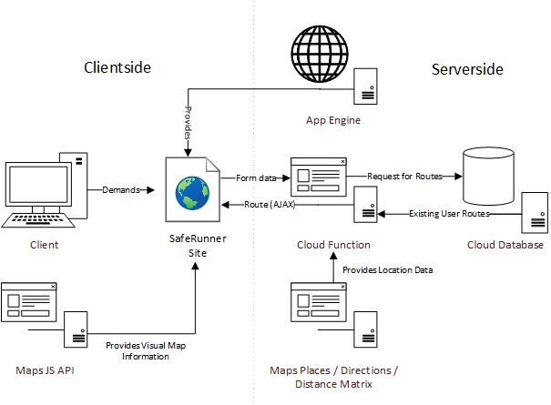

# SafeRunner

__SafeRunner__ is a project that allows users to plan a route to go for a run without worrying about finding other people. It is very well suited for these times of pandemic. Or if you just don't want to be bothered, which is also fine.

## Getting Started

To work with this project we recommend the following setup:

- A XAMPP server for the App Engine website. We used it extensively to test client-side code.
- Any text editor for Python, PHP, Javascript and CSS code.
- An internet connection to get Bootstrap, JQuery, Google API's and connect to the web services (duh)
- A Google Cloud account with access to Maps Javascript API, a cloud function, a SQL database and an App Engine for deployment.

## Installing

Run the [XAMPP](https://www.apachefriends.org/download.html) installer. Also set up a [Google Cloud Account](https://cloud.google.com/).

In order to get the website running you must copy the contents of the htdocs directory of the repository inside the XAMPP install htdocs directory. Boot up the XAMPP control panel, activate the Apache server and the SQL server and now browsing Localhost should yield something like :

To get both the App Engine, cloud function and SQL database we suggest following Google's [official documentation on the subject](https://cloud.google.com/docs). They know better than we do.

You should change the [php key](htdocs/www/secret/key.php) and instances of links referring to the services found in [the javascript asynchronous call in the map function](htdocs/www/js/map.js). You should also change database credentials in the python cloud function.

## Deployment

For deployment you should follow Google's [official documentation on the subject](https://cloud.google.com/docs). You should run an App engine, a Cloud Function and a Cloud SQL database, as well as getting yourself an API key for Maps.

## Architecture

This is the architecture of the .

The overall connection scheme between components is depicted, showing which calculations shall be performed server-side (those regarding the creation of the route itself) and which ones shall be performed client-side (which are mostly aesthetic to provide a better user experience). A key design decision was using AJAX to update the route on the client-side, since we would otherwise have to call the cloud function from the server, ultimately giving a slower and less fluid user experience as well as needlessly complicating the communication scheme. Aside from that, the design is straightforward: the App Engine instance provides the SafeRunner site as an HTML (implemented through php). This html file carries a form that needs to be filled with date, running pace and time, as well as an origin point. On user submission, the form is sent to the cloud function that processes the route with other users' data stored in our databases and returns the route dynamically through AJAX.

## Authors

Adria Carrasquilla, Marc Espinosa, Raul Estrada, Jan Moros, Pau Torras

## Acknowledgements

Thanks to all of this project's mentors, especially Eric Espinola who saved us from certain death by pointing us to cloud functions.